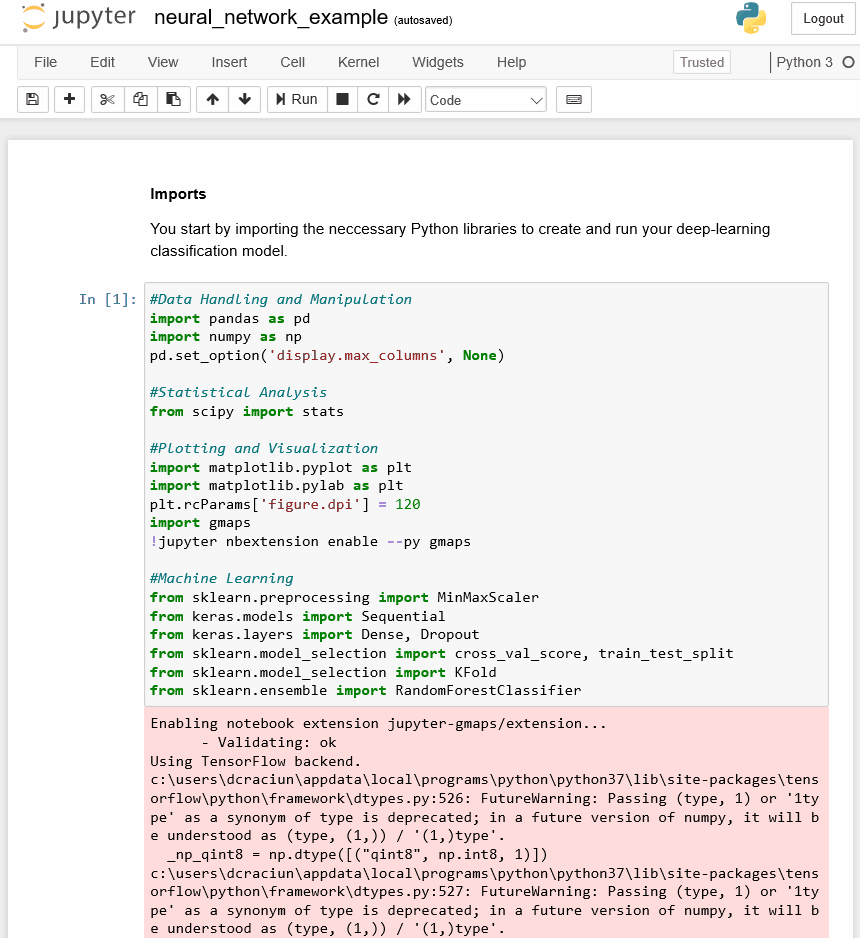

# Introduction 
This repository is a demonstration of a neural network deep learning analysis, in Python, based on loans and demographics data, to predict if a loan will be accepted or denied. The data used in the analysis is available as [FusionFabric.cloud datasets](https://developer.fusionfabric.cloud/explore/datasets).  


# Getting Started

**To run this sample**
> You need a recent installation of [Python](https://www.python.org/) and [Jupyter](https://jupyter.org/). However, due to the dependency on the **keras** library, you must install a compatible Python version, such as 2.7 or 3.6, or previous versions. See the library repository [Readme.md](https://github.com/keras-team/keras/blob/master/README.md) for details.
> If you are new to Python, check out the [Beginner's Guide to Python](https://wiki.python.org/moin/BeginnersGuide), which contains instructions on how to install Python.
> Install Jupyter by following the instructions from the [project documentation](https://jupyter.org/install.html).  

1. Register an application on [FusionCreator](https://developer.fusionfabric.cloud), and include the [Demographics](https://developer.fusionfabric.cloud/dataset/demographics-v1-2e6f9318-5d0c-464b-bf21-ee7069cfcb49) and [Customer Loans](https://developer.fusionfabric.cloud/dataset/customer-loans-v1-2e6f9318-5d0c-464b-bf21-ee7069cfcb49) datasets.
2. Clone the current project and navigate to its directory.
3. Add the datasets to the **Data** directory. The two required CSV files are **customer_loans.csv** and **customer_demographics.csv**.
4. Open a command prompt or a terminal, and install the required Python packages:
```
pip install pandas numpy scipy matplotlib gmaps keras sklearn tensorflow
```
5. Run Jupyter with the following command:
```
jupyter lab
``` 
  > A browser page opens with a file browser on the left side bar that lists all the files from the current directory.  
6. In the Jupyter file navigation pane, double-click **neural_network_example.jpynb**. The notebook opens in the main panel. 
7. Follow the steps from the notebook. Rerun the code cells one by one by clicking **Run the selected cell and advance** from the notebook toolbar. 

# Learn More

To learn how to create this sample project from scratch, follow the tutorial from [Developer Portal Documentation](https://developer.fusionfabric.cloud/documentation/sample-client-datasets). 

# License

This sample client application is released under the MIT License. See [LICENSE](LICENSE) for details.